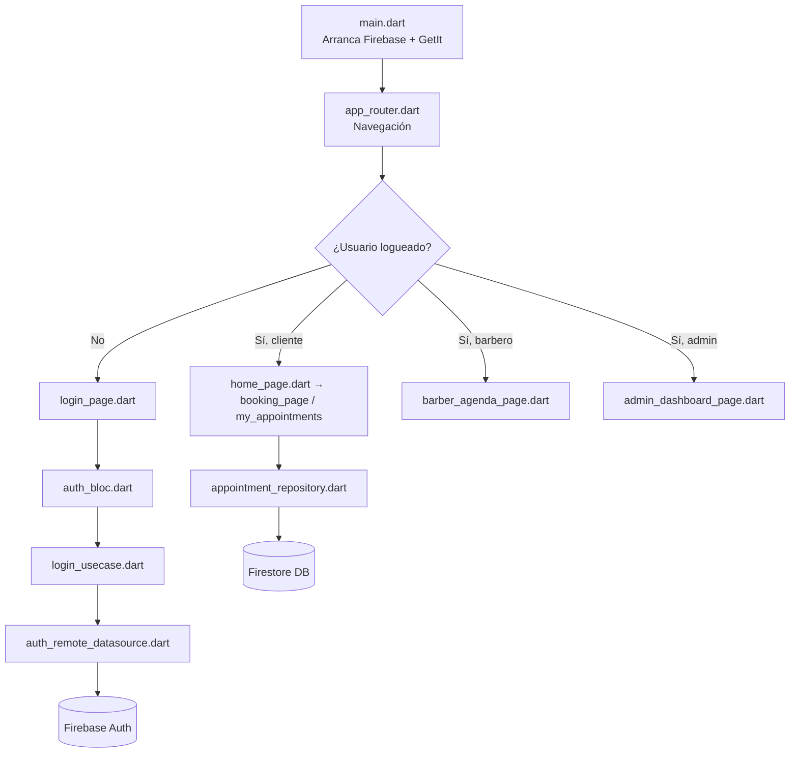

# 📱 Explicación del Proyecto BarberTurno

## 🏠 ¿Qué es este proyecto?

**BarberTurno** es una app móvil hecha en Flutter para gestionar citas de barbería.
Tiene **3 tipos de usuarios**: clientes, barberos y administradores.

---

## 🗂️ Carpetas raíz del proyecto

```
barber_turno/
├── lib/              ← 🧠 TODO el código Dart de la app va aquí
├── android/          ← Configuración para compilar en Android
├── ios/              ← Configuración para compilar en iPhone
├── assets/           ← Imágenes, fuentes u otros recursos estáticos
├── docs/             ← Documentación del proyecto (texto explicativo)
├── test/             ← Pruebas automáticas
├── pubspec.yaml      ← Lista de dependencias (como un package.json)
├── firebase.json     ← Configuración de Firebase
└── firestore.rules   ← Reglas de seguridad de la base de datos
```

> [!NOTE]
> La carpeta `lib/` es donde vive TODO el código que tú escribes.
> Las carpetas `android/`, `ios/`, `web/`, `windows/`, `linux/`, `macos/`
> son generadas por Flutter y casi no se tocan.

---

## 🧠 Dentro de `lib/` — El corazón de la app

```
lib/
├── main.dart              ← Punto de entrada de la app (arranca todo)
├── firebase_options.dart  ← Claves de conexión a Firebase (auto-generado)
├── config/                ← Tema visual y rutas de navegación
├── core/                  ← Cosas reutilizables en toda la app
├── features/              ← Módulos (cada función del negocio)
└── injection/             ← Fábrica de objetos (crea instancias)
```

---

## ⚙️ `config/` — Configuración global de la app

| Archivo | ¿Para qué sirve? |
|---|---|
| `app_router.dart` | Define todas las **pantallas** y cómo navegar entre ellas. Es como el mapa de la app: "si el usuario pulsa X, llévalo a la pantalla Y". |
| `app_theme.dart` | Define los **colores, tipografías y estilo visual** de toda la app. |

---

## 🔧 `core/` — Código reutilizable en toda la app

```
core/
├── constants/
│   └── app_constants.dart     ← Nombres de colecciones Firestore, roles, estados
└── utils/
    ├── appointment_status_ui.dart  ← Convierte un estado a color/texto para la UI
    └── go_router_refresh_stream.dart ← Ayuda al router a reaccionar cuando cambia el login
```

### 📋 `app_constants.dart`
Guarda **textos fijos** que se usan en todo el proyecto para no repetirlos:
- Nombres de colecciones de Firestore: `"users"`, `"appointments"`, `"services"`, etc.
- Roles de usuario: `"client"`, `"barber"`, `"admin"`
- Estados de una cita: `"pending"`, `"confirmed"`, `"cancelled"`, etc.

### 🎨 `appointment_status_ui.dart`
Convierte un estado (`"confirmed"`) en algo visual: un color verde y el texto "Confirmada".

### 🔄 `go_router_refresh_stream.dart`
Pequeño truco técnico: hace que la navegación se actualice automáticamente cuando el usuario inicia o cierra sesión.

---

## 🚀 `injection/` — Fábrica de dependencias

```
injection/
└── injection.dart   ← Registra todos los objetos que la app necesita crear
```

Piénsalo como una **fábrica**: en vez de que cada pantalla cree sus propios objetos (repositorios, BLoCs, etc.), los registras una sola vez aquí y los "pides prestados" cuando los necesitas. Esto se hace con el paquete `get_it`.

---

## 🎯 `features/` — Los módulos de la app

Esta es la carpeta más importante. Cada subfolder es **un módulo independiente** con su propia lógica:

```
features/
├── auth/           ← Login y Registro
├── home/           ← Pantalla de inicio (redirige según rol)
├── appointments/   ← Reservar y ver mis citas (cliente)
├── services/       ← Catálogo de servicios
├── barber/         ← Agenda del barbero
├── admin/          ← Panel de administrador
└── schedule/       ← Horarios y disponibilidad
```

Cada feature sigue el mismo patrón de **3 capas** (Clean Architecture):

```
feature/
├── data/          ← Habla con Firebase (base de datos real)
├── domain/        ← Lógica del negocio (reglas puras)
└── presentation/  ← Lo que el usuario ve (pantallas y BLoC)
```

---

## 🏛️ Las 3 Capas — Explicadas con un ejemplo real

> Imagina que el usuario quiere **iniciar sesión**:

```
[Usuario toca "Entrar"] 
       ↓
[PRESENTATION] login_page.dart    → La pantalla captura email y contraseña
       ↓
[PRESENTATION] auth_bloc.dart     → El BLoC recibe el evento "LoginRequested"
       ↓
[DOMAIN]       login_usecase.dart → El caso de uso dice "ejecuta el login"
       ↓
[DATA]         auth_remote_datasource.dart → Llama a Firebase Auth
       ↓
[Firebase]     Devuelve el usuario o un error
       ↓
[PRESENTATION] auth_state.dart    → Estado cambia a "Authenticated"
       ↓
[Usuario ve la pantalla principal]
```

---

## 📦 Detalle de cada Feature

---

### 🔐 `auth/` — Autenticación ✅ HECHO

**¿Qué hace?** Registrar usuarios nuevos e iniciar sesión con email y contraseña (Firebase Auth).

```
auth/
├── data/
│   ├── datasources/
│   │   └── auth_remote_datasource.dart  ← Llama a Firebase Authentication
│   ├── models/
│   │   └── user_model.dart              ← Usuario con métodos para leer/guardar en Firestore
│   └── repositories/                    ← (implementación del repo)
├── domain/
│   ├── entities/
│   │   └── user_entity.dart             ← Objeto "Usuario" puro (sin dependencias Firebase)
│   ├── repositories/                    ← (interfaz abstracta)
│   └── usecases/
│       ├── login_usecase.dart           ← Caso de uso: iniciar sesión
│       ├── register_usecase.dart        ← Caso de uso: registrarse
│       └── logout_usecase.dart          ← Caso de uso: cerrar sesión
└── presentation/
    ├── bloc/
    │   ├── auth_bloc.dart               ← Maneja los eventos de auth y cambia estados
    │   ├── auth_event.dart              ← Eventos: LoginRequested, RegisterRequested, LogoutRequested
    │   └── auth_state.dart             ← Estados: Loading, Authenticated, Error
    └── pages/
        ├── login_page.dart              ← Pantalla de inicio de sesión
        └── register_page.dart           ← Pantalla de registro
```

---

### 🏠 `home/` — Pantalla de Inicio

**¿Qué hace?** Después de hacer login, redirige al usuario a su pantalla correcta según su rol (cliente, barbero o admin).

```
home/
└── presentation/
    └── pages/
        └── home_page.dart   ← Lee el rol del usuario y redirige
```

---

### 📅 `appointments/` — Citas del Cliente ✅ HECHO

**¿Qué hace?** Permite al cliente **reservar una cita** y **ver sus citas existentes**.

```
appointments/
├── data/
│   ├── models/
│   │   └── appointment_model.dart       ← Cita con serialización para Firestore
│   └── repositories/
│       └── appointment_repository.dart  ← CRUD de citas en Firestore
└── presentation/
    └── pages/
        ├── booking_page.dart            ← Pantalla para RESERVAR una cita (seleccionar barbero, servicio, hora)
        └── my_appointments_page.dart    ← Pantalla "Mis Citas" del cliente
```

---

### ✂️ `barber/` — Agenda del Barbero

**¿Qué hace?** El barbero ve las citas del día, puede **confirmar o rechazar** cada una.

```
barber/
├── data/
│   ├── models/
│   │   └── barber_model.dart            ← Datos del barbero
│   └── repositories/
│       └── barber_repository.dart       ← Lee citas del barbero desde Firestore
└── presentation/
    ├── bloc/
    │   ├── barber_bloc.dart             ← Lógica: cargar citas, confirmar, rechazar
    │   ├── barber_event.dart            ← Eventos: LoadAppointments, ConfirmAppointment, etc.
    │   └── barber_state.dart            ← Estados: Loading, Loaded, Error
    └── pages/
        └── barber_agenda_page.dart      ← Pantalla principal del barbero (agenda diaria)
```

---

### 🛠️ `services/` — Catálogo de Servicios

**¿Qué hace?** Muestra la lista de servicios de la barbería (corte, barba, etc.) con precio y duración.

```
services/
├── data/
│   ├── models/
│   │   └── service_model.dart           ← Servicio (nombre, precio, duración)
│   └── repositories/
│       └── service_repository.dart      ← Lee servicios activos de Firestore
└── presentation/
    ├── bloc/
    │   ├── service_bloc.dart            ← Lógica: cargar servicios
    │   ├── service_event.dart
    │   └── service_state.dart
    └── pages/
        └── services_page.dart           ← Pantalla del catálogo de servicios
```

---

### 👑 `admin/` — Panel Administrador

**¿Qué hace?** El admin gestiona todo el negocio desde aquí.

```
admin/
└── presentation/
    └── pages/
        ├── admin_dashboard_page.dart    ← Panel principal: resumen del negocio, ingresos
        ├── manage_services_page.dart    ← CRUD de servicios (crear, editar, borrar)
        ├── manage_barbers_page.dart     ← CRUD de barberos
        ├── manage_schedule_page.dart    ← Configurar horarios generales
        └── admin_appointments_page.dart ← Ver todas las citas programadas
```

---

### 🕐 `schedule/` — Motor de Horarios ✅ HECHO

**¿Qué hace?** Calcula qué horas están **disponibles** para reservar una cita, evitando solapamientos.

```
schedule/
├── data/
│   ├── models/
│   │   └── business_hours_model.dart    ← Modelo de horario de apertura/cierre
│   └── repositories/
│       └── schedule_repository.dart     ← Lee horarios desde Firestore
└── domain/
    └── availability_engine.dart         ← 🧮 Motor: calcula slots libres dado barbero + fecha
```

> [!TIP]
> `availability_engine.dart` es un archivo clave: recibe las citas ya reservadas y el horario del barbero,
> y devuelve los **intervalos de tiempo libres** para mostrar al cliente al momento de reservar.

---

## 📄 `docs/` — Documentación del proyecto

| Archivo | Contenido |
|---|---|
| `ARQUITECTURA.md` | Diagrama y explicación de la Clean Architecture usada |
| `ENTORNO_DESARROLLO.md` | Cómo instalar y correr el proyecto localmente |
| `SEGURIDAD.md` | Explicación de las reglas de Firestore |
| `TRELLO.md` | Tablero de tareas del equipo |

---

## 🔄 Flujo completo: ¿Cómo funciona todo junto?



---

## 📦 Paquetes clave usados (`pubspec.yaml`)

| Paquete | ¿Para qué sirve? |
|---|---|
| `flutter_bloc` | Gestión de estado con el patrón BLoC |
| `go_router` | Navegación entre pantallas |
| `get_it` | Inyección de dependencias (fábrica de objetos) |
| `firebase_auth` | Autenticación de usuarios |
| `cloud_firestore` | Base de datos en tiempo real |

---

## 🧩 Resumen Visual

```
app
 ↓
main.dart → inicializa Firebase y GetIt
 ↓
app_router.dart → decide qué pantalla mostrar
 ↓
feature/presentation/pages → lo que el usuario ve
 ↓
feature/presentation/bloc → lógica y estado de la UI
 ↓
feature/domain/usecases → reglas de negocio
 ↓
feature/data/repositories → acceso a datos
 ↓
Firebase (Firestore + Auth) → base de datos real
```
